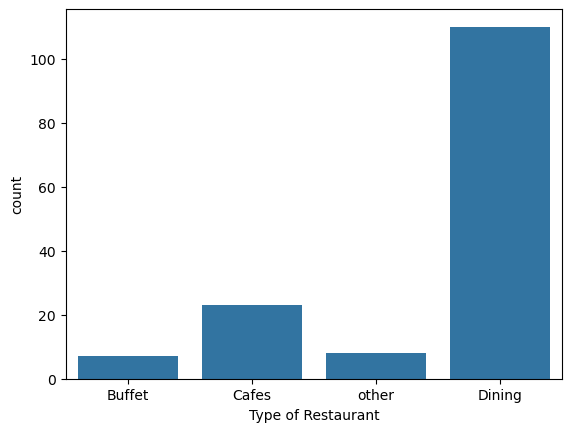

# Introduction
This repository contains an exploratory data analysis (EDA) project focused on Zomato restaurant data. Using Python and libraries like Pandas, Matplotlib, and Seaborn, I have analyzed various aspects of customer preferences, restaurant ratings, and ordering trends.

# Tools Used
These are the list of tools I used

- **Python**
- **Visual Studio Code**
- **Jupyter Notebooks**
- **Github**

# Data Preparation and Cleanup
Import the necessary libraries

```Python
import pandas as pd
import numpy as np
import matplotlib.pyplot as plt
import seaborn as sns
```

Load the dataset and create a dataframe
```Python
dataframe = pd.read_csv('E:/Python_Zomato_Analysis_Project/Zomato_data.csv')
```

Convert the data type of column `rate` to include only the ratings in float point format.
```Python
def handleRate(value):
    value = str(value).split('/')
    value = value[0]
    return float(value)

dataframe['rate'] = dataframe['rate'].apply(handleRate)
```

Check for missing values in the dataset
```Python
dataframe.info()
```

# Analysis
## Q1 What type of restaurants do the majority of customers order from?
Here we create a plot to find which type of restaurants the majority of customers order from

```Python
sns.countplot(x=dataframe['listed_in(type)'])
plt.xlabel("Type of Restaurant")
plt.show()
```
### Results


### Insights
- Dining restaurants are the most popular among customers, receiving the highest number of orders compared to other types of restaurants.
- Buffets and other restaurant types have significantly lower order counts, indicating a lesser preference among customers.


## Q2 How many votes has each type of restaurant recieved from customers?
Here we find out how many votes each type of restaurant has recieved.

```Python
grouped_data = dataframe.groupby('listed_in(type)')['votes'].sum()
```
Buffet ranks the lowest with a total count of 3028 while Dining ranks the highest with a total count of 20363.

```Python
result = pd.DataFrame({'votes':grouped_data})
plt.plot(result, c='green', marker='o')

plt.xlabel('Type of Restaurant', c='r', size=20)
plt.ylabel('Votes', c='red', size=20)
plt.show()
```

### Results


### Insights
- Dining restaurants are the most preferred among customers, whereas buffets are the least preferred.

## Q3 What is the rating that the majority of restaurants have recieved?
Here we find out what rating the majority of restaurants have recieved.

```Python
plt.hist(dataframe['rate'], bins=2, edgecolor='black')
plt.title('Ratings Distribution')
plt.show()
```

### Results


### Insights
- Most restaurants have received ratings between 3.75 and 4.5, indicating that the majority of customers rate their experience positively.
- Fewer restaurants have ratings below 3.5, suggesting that low-rated restaurants are less common on Zomato.

## Q4 Zomato has observed that most couples order most of their food online. What is their average spending on each order?
Here we find out the average spending per order by couples.

```Python
couple_data = dataframe['approx_cost(for two people)']
sns.countplot(x=couple_data, hue=couple_data, palette='viridis', legend=False)
plt.title("Approximate Cost for Two People")
plt.xlabel("Cost")
plt.ylabel("Count")
plt.show()
```

### Results


### Insights
- The majority of couples prefer restaurants with an approximate cost of Rs 300.

## Q5 Which mode(online or offline) has received the maximum rating?
Here we find out which mode of ordering food is more popular.

```Python
plt.figure(figsize = (6, 6))
sns.boxplot(x = 'online_order', y = 'rate', data=dataframe)
plt.show()
```

### Results


### Insights
- Offline orders receive lower ratings in comparision to online ratings.

## Q6 Which type of restaurant received more offline orders so that Zomato can provide some good offers to its customers?
Here we try to analyse which restaurants has more offline orders so that Zomato can plan discounts and campaigns for that restaurant accordingly.

```Python
pivot_table = dataframe.pivot_table(index='listed_in(type)', columns='online_order', aggfunc='size', fill_value=0)
sns.heatmap(pivot_table, annot=True, cmap='YlGnBu', fmt='d')
plt.title('Heatmap')
plt.xlabel('Online Order')
plt.ylabel('Listed In (Type)')
plt.show()
```

### Results


### Insights
- Dining restaurants primarily accept offline orders, whereas cafes primarily receive online orders. This suggests that customers prefer ordering in person at restaurants, but prefer ordering online from cafes.

# Conclusion
This project provided informative insights about the customers and their ordering preference.